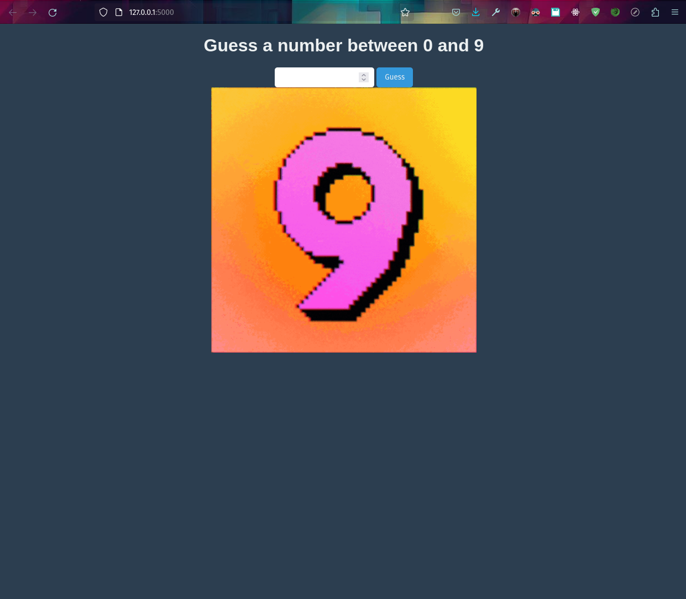

# Guess the Number Game

A simple web-based game where users are prompted to guess a random number between 0 and 9. The game provides feedback on whether the guess is too high, too low, or correct.

## Features

- Dark-themed user interface for a pleasant user experience.
- Dynamic feedback with fun GIFs based on the user's guess.
- Mobile-responsive design.

## Setup and Run

1. Ensure you have Python and Flask installed.
2. Clone the repository.
```
git clone https://github.com/j-breedlove/higher_lower_flask.git
```
3. Navigate to the project directory and run:
```
cd higher_lower_flask
```

```
python app.py
```

4. Open a web browser and visit `http://127.0.0.1:5000/` to play the game.

## Contributing

Pull requests are welcome. For major changes, please open an issue first to discuss what you would like to change.

## License

[MIT](https://choosealicense.com/licenses/mit/)
